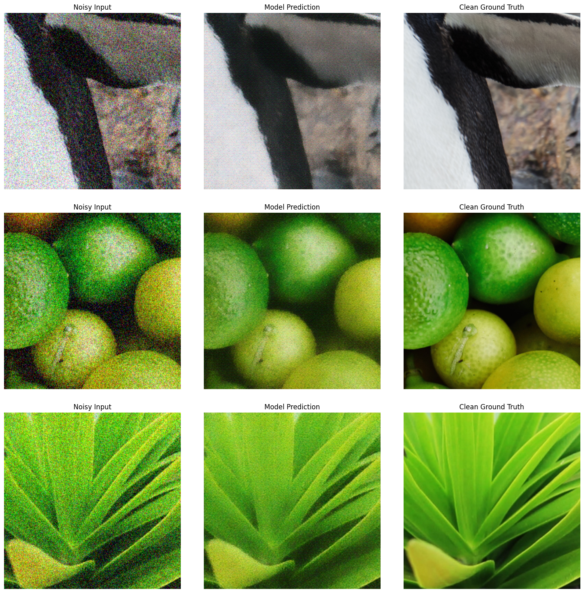

# Self-Supervised Image Denoising (Noise2Noise)
An educational project implementing Image Denoising without using clean "Ground Truth" data during training.

## 🎯 Problem Statement
Traditional supervised learning requires pairs of (Noisy, Clean) images. However, in real-world scenarios (medical imaging, astrophotography, extreme low-light photography), a perfectly clean reference often does not exist.  

**Goal**: Train a neural network to restore images using only noisy data.  

**Methodology:** The project utilizes the **Noise2Noise** approach combined with Perceptual Loss.
We train the network to predict one noisy realization of a scene from another noisy realization of the same scene.

$$\mathcal{L}_{total} = || f(x + n_1) - (x + n_2) ||_1 + \lambda \mathcal{L}_{perceptual}$$

Where:
* $x + n_1$: Input noisy image.
* $x + n_2$: Target noisy image (different noise realization).
* $f(\cdot)$: The neural network (denoiser).
* $||\cdot||_1$: L1 Loss (promotes sharpness compared to MSE).
* $\mathcal{L}_{perceptual}$: VGG-based loss (preserves textures).

Since the expected value of the noise (assuming Zero-Mean Gaussian) is zero ($E[n] = 0$), the network mathematically converges to the clean signal $x$ to minimize the error.

## 🏗 Architecture & Technologies
The project is built on PyTorch Lightning for code organization and Hydra for configuration management.
### Advanced ResUNet
Instead of a vanilla U-Net, this project implements a modified modern architecture:
1. **Residual Learning**: The network predicts the noise map rather than the image itself. This map is subtracted from the input (Global Residual Connection).
2. **ResBlocks + SE-Blocks**: Convolutional blocks utilize Squeeze-and-Excitation modules (Channel Attention), allowing the network to recalibrate channel-wise feature responses adaptively.
3. **Attention Gates**: Skip-connections are equipped with attention mechanisms that filter noise when transferring features from the Encoder to the Decoder.
4. **PixelShuffle Upsampling**: Standard bilinear upsampling is replaced with PixelShuffle (sub-pixel convolution) to recover high-resolution details without "checkerboard" artifacts.

### Loss Functions
A combined loss function is used for training:
- **L1 Loss (Pixel-wise)**: Responsible for general structure and denoising. L1 is preferred over MSE as it produces sharper edges.
- **Perceptual Loss (VGG-based)**: Compares feature maps extracted from a pre-trained VGG-16 network. It helps restore textures and complex patterns that are often smoothed out by pixel-wise losses.

## 📂 Project Structure
<pre>
project_root/
├── configs/                 # Hydra configurations (.yaml)
│   ├── config.yaml          # Entry point
│   ├── model/               # Model architecture params
│   ├── data/                # Dataset params
│   └── train_params/        # Hyperparameters (lr, epochs, etc.)
├── src/
│   ├── data_module.py       # Data pipeline (Augmentations, On-the-fly Noise)
│   ├── lightning_module.py  # Lightning wrapper (Training steps, Metrics)
│   ├── models/              # Architecture definition (AdvancedUNet, Blocks)
│   └── losses/              # Custom losses (Perceptual)
├── train.py                 # Training script
├── inference.py             # Visualization/Inference script
└── requirements.txt         # Dependencies
</pre>

## 🚀 Installation & Usage

### 1. In your virual environment, install PyTorch according to your cuda version from *[pytorch.org](https://pytorch.org/)*

### 2. Install the rest of dependencies
```bash
pip install -r requirements.txt
```
### 3. Prepare Data
Place your high-quality images in the following directories (e.g., DIV2K dataset):
- data/train
- data/valid  

### 4. Training
Run with default configuration:
```bash
python train.py
```
Training logs and visualization samples are automatically uploaded to WandB.

### 5. Inference
To visualize the results of a trained model:
```bash
python inference.py --checkpoint /path/to/your/checkpoint.ckpt
```

### Example of inference on unseen data after 50 epochs training from scratch:


## 📊 Metrics
Quality estimation relies on two metrics:
- **PSNR (Peak Signal-to-Noise Ratio)**: Standard metric for reconstruction quality.
- **LPIPS: Learned Perceptual Image Patch Similarity**: A metric that correlates better with human perception than pixel-wise metrics.